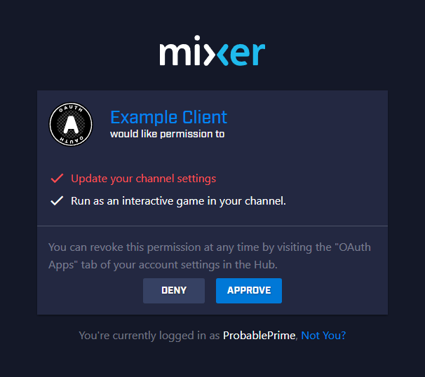
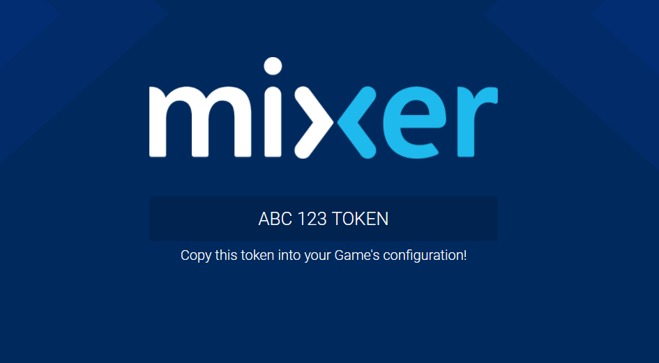

# implicit-oauth-example
An example site for carrying out the implicit OAuth Flow with Mixer.

# Setup
1. Create an OAuth Application at our [Developer Lab](https://mixer.com/lab).

1. Using a webserver redirect a url on that server  e.g. `interactive.example.com/request` to the Mixer OAuth authorize page with your OAuth Client Id and Scopes filled out:

  `https://mixer.com/oauth/authorize?response_type=token&redirect_uri=<redirecturl>&scope=<scopes>&client_id=<clientid>`

  Example url:

  `https://mixer.com/oauth/authorize?response_type=token&redirect_uri=https://interactive.example.com&scope=interactive:robot:self&client_id=abc123456`

1. Ensure your redirect uri sends users to the index of this repository.

# Flow

User visits link `interactive.example.com/request` and sees the OAuth Page:  

They click accept and are then forwarded back to your url where they will see their token:  

The user can then paste this token into your Project's config.

# Customization

Feel free to customize the page for your branding. Please ensure you follow the [Mixer Branding Guidelines](https://github.com/mixer/branding-kit/)
